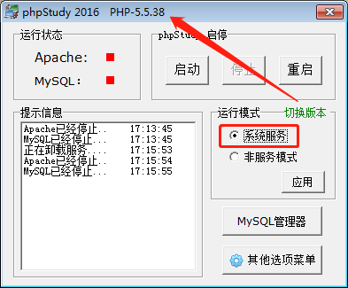

# 在线监测系统服务器运维手册


## 前言

本手册供我司在线监测系统服务器运维人员使用。

本手册致力于做到
_覆盖面广_（涉及所有重要的内容），
_具体_（给出具体的最常用的例子），
_简洁_（避免冗余的内容，或是可以在其他地方轻松查到的细枝末节）。
熟练的掌握本手册所述内容能帮助你节约大量的时间。

本手册使用 MIT 开源协议，欢迎大家贡献自己的内容 。

### 在线查阅 

-   本手册在不断的充实完善，建议关注后在线查阅。你的支持也是我们进步的动力。

-   :link: https://github.com/haithing/manual

### 反馈建议 

-   如果你在本手册中发现了错误或者存在可以改善的地方，请贡献你的一份力量。

-   :link: https://github.com/haithing/manual/issues

### 下载手册 

-   本手册提供了 pdf 、 word 等多种版本供下载后查阅，请随时关注更新并获取最新的版本。

-   :link: https://github.com/haithing/manual/releases/latest

### 版本记录

| 版本号 |  修订时间  | 修订说明                    |
| :----: | :--------: | --------------------------- |
|  v0.1  | 2019/10/15 | 开始编写手册                |
|  v0.2  | 2019/10/15 | 添加 Linux 服务器运维章节   |
|  v0.3  | 2019/10/16 | 添加 Windows 服务器运维章节 |

## Linux 服务器运维


我司项目服务端选用 Ubuntu 16.04 LTS 发行版。
本手册所述流程及所列示例均基于此发行版。

本章节基于 _理论够用、侧重实用_ 的原则来说明 Linux 服务器的基本运维操作。

### 终端

我们通过 **终端 (Terminal)** 来和装载有 Linux 系统的服务器进行交互。
在 Linux 系统上可以通过按 **Ctrl+Alt+T** 快捷键打开终端。
在 Windows 系统上我们需要额外安装终端软件来远程登录到服务器。
常见的终端软件有 Xshell 、 Git 、 SecureCRT 、 PuTTY 等。

**_Xshell_**


-   请在 [附录 - 常用软件](#xshell) 获取下载链接。

-   Xshell 是收费软件，需注意试用期问题。

-   安装后通过桌面快捷方式打开软件。

**_Git_**


-   请在 [附录 - 常用软件](#git) 获取下载链接。

-   Git for Windows 的功能十分强大，我们仅使用其中一小部分功能。

-   安装后在桌面点右键，选择 `Git Bash Here` 打开软件。

下文中 **终端** 泛指上述软件中的任意一个。

### 操作技能

熟悉以下操作技能可以让你在操作时事半功倍，还让你显得很酷 :sunglasses: 。

#### 自动补全

按 **Tab** 键实现自动补全参数。
自动补全不仅能有效提高输入效率，还可以 _避免输入错误_ :100: 。

请参阅以下示例（ `→` 表示 **Tab** 键）练习。

```bash
cd /var/www/media/log/
cd /v→w→m→l→

sz server.log
sz s→

history
his→
```

#### 快捷键

|           按键           |          操作          |
| :----------------------: | :--------------------: |
|        **Ctrl+C**        |        中断操作        |
|     **Ctrl+Insert**      |          复制          |
|     **Shift+Insert**     |          粘贴          |
| **Ctrl+P**（或向上箭头） |   获取前一个历史命令   |
| **Ctrl+N**（或向下箭头） |   获取后一个历史命令   |
| **Ctrl+B**（或左箭头键） |   将光标回退一个字符   |
| **Ctrl+F**（或右箭头键） |   将光标前进一个字符   |
|        **Ctrl+A**        |     移动光标至行首     |
|        **Ctrl+E**        |     移动光标至行尾     |
|        **Ctrl+K**        |   删除光标之后的内容   |
|        **Ctrl+U**        |   删除光标之前的内容   |
|        **Ctrl+W**        | 删除光标之前的一个单词 |
|        **Ctrl+Y**        |   恢复之前删除的内容   |
|        **Ctrl+T**        |   交换前两个字符位置   |
|        **Ctrl+L**        |          清屏          |

#### 更多

-   可以打开多个 **终端** 来进行不同的操作。

-   使用 `history` 命令查看历史记录，输入 `!n`（`n` 是命令编号）就可以再次执行。

-   使用 `sudo reboot` 命令重启服务器。

### 连接到服务器

> 请勿在 xshell 中保存服务器密码。

打开 **终端** ，输入命令 `ssh 用户名@服务器`（如 `ssh hs@192.168.8.2`），回车，输入密码，出现 `Welcome to XXX` 信息即已成功连接服务器。

-   服务器 ip 地址与客户端网页地址一致，阀厅项目通常为 `192.168.8.2` 。

-   用户名通常为 `hs` 。

-   在 **终端** 输入密码时无任何反馈，且输入错误无法删除。

### 目录操作

-   目录层级用 `/` 分隔。

-   用 `cd` 命令切换工作路径，输入 `cd ~` 可以进入 home 目录。要访问你的 home 目录中的文件，可以使用前缀 `~`（例如 `~/server`）。输入 `cd -` 回到前一个工作路径。

-   用 `pwd` 命令查看当前目录。

-   绝对路径从根目录（`/`）开始，如 `/var/www/html` 。

-   相对路径从当前目录开始，`.` 表示当前目录， `..` 表示当前目录的上层目录。

```bash
$ cd /var/www/html && pwd
/var/www/html
$ cd ../media && pwd
/var/www/media
$ cd ./picture && pwd
/var/www/media/picture
$ cd ../../media/report && pwd
/var/www/media/report
```

#### 常用目录

| 目录                     | 说明             |
| ------------------------ | ---------------- |
| `/var/www/media/log`     | 日志存放目录     |
| `/var/www/media/report`  | 报表存放目录     |
| `/var/www/media/picture` | 图片存放目录     |
| `/var/www/media/video`   | 视频存放目录     |
| `/var/www/html`          | 网页工作目录     |
| `~/server`               | 服务程序工作目录 |

### 上传下载文件

#### _scp_

在 **终端** （无需连接到服务器）操作。

```bash
# 从本地拷贝文件到服务器
scp source_file user@host:directory/target_file
# 示例：上传报表生成脚本
scp default.php hs@192.168.8.2:/var/www/media/report

# 从服务器拷贝文件到本地
scp user@host:directory/source_file target_file
# 示例：下载服务程序日志
scp hs@192.168.8.2:/var/www/media/log/server.log ./
```

#### _zmodem (lrzsz)_

使用 zmodem 协议前需通过 xshell 连接到服务器。

-   **`rz` 命令** 即 _receive_ ，服务器接收，客户机上传。

    -   运行该命令会弹出一个文件选择窗口，从本地选择文件上传到服务器。

    -   如果服务器上存在同名文件，需先删除。

-   **`sz` 命令** 即 _send_ ，服务器发送，客户机下载。

    -   将选定的文件下载到本地。

### 编辑配置文件

#### 在服务器上编辑

1. 输入 `vim [filename]` 开始编辑。

1. 按 **i** 进入编辑模式。

1. 编辑配置文件。

1. 按 **Esc** 退出编辑模式。

1. 按 **Shift+;** 进入命令行模式。

    - 输入 `w` 保存文档。

    - 输入 `q` 退出文档。

    - 输入 `wq` 保存并退出文档。

#### 下载到本地后编辑

通过 [上传下载文件](#上传下载文件) 所述方法下载配置文件到本地，编辑后上传到服务器。
本地编辑时请注意保持换行符为 `LF` 。


推荐使用 [Visual Studio Code](#visual-studio-code) 进行本地编辑。

### 系统时间管理

-   使用 `date` 命令来查看系统时间，`date +%s` 查看时间戳， `date +%F\ %T` 可以让输出的时间更直观。

-   使用 `date -d @时间戳` 可以解析时间戳。

-   使用 `date -s 时间` 可以设置系统时间。

```bash
$ date -s 10:00:00
2019年 10月 01日 星期二 10:00:00 CST
$ date +%s
1569895200
$ date -d @1569895200 +%F\ %T
2019-10-01 10:00:00
```

### 系统状态查看

-   使用 `ifconfig` 命令获取网络连接状态。

-   使用 `uptime` 或 `w` 命令来查看系统运行时间。

-   使用 `top` 命令查看进程所占系统资源。

-   使用 `df -h` 命令查看硬盘的使用。

## Windows 服务器运维

部分项目未单独配置服务器，这些项目中客户端也作为服务器使用。

### 配置 Windows 服务器

#### 配置流程

_请严格按配置流程操作，任何遗漏都将引发不可预期的后果。_

_Please strictly follow the configuration process, any of your omissions will lead to unexpected consequences._

1.  请在 Windows 7 或更高版本的操作系统上操作。

1.  在 Windows 10 操作系统上部署本系统服务端时需激活并切换至 **_administrator_** 用户。

    > _以 **管理员身份** 运行命令 `net user administrator /active:yes`_ 。

1.  配置 _用户账户控制(UAC)_ 为 `从不通知` 。

1.  安装 _支持组件(support.exe)_ 到 **_d:\etc_** 目录。

    > http://server.haithing.com/ois/windows/support/support.exe

1.  获取 _安装包_ 并解压至 **_d_** 盘任意位置。

    > http://server.haithing.com/ois/windows/

1.  以 **管理员身份** 运行 **_setup.bat_** 执行安装操作。

1.  在 _支持组件_ 中切换版本为 `"php-5.5.38 + Apache"` ，设置运行模式为 `"系统服务"` 。

    

1.  在 **Internet Explore 11** 浏览器中输入地址 [`http://localhost`](http://localhost) 打开客户端网页。

#### 配置说明

-   服务程序可部署至任意磁盘分区，但需与支持组件位于同一磁盘分区。

-   如安装过程中提示缺少组件，请安装 _运行库_ 后再次尝试。

    > 32 位 http://server.haithing.com/ois/windows/support/runtime_x86.exe

    > 64 位 http://server.haithing.com/ois/windows/support/runtime_x64.exe

-   请安装 [常用软件](#常用软件) 。

## 数据库配置

## 疑问解答与故障处理

### 界面

#### :question: 设置界面标题与 logo

-   疑问

客户要求修改界面标题与 logo ，该如何操作呢？

-   解答

点击界面右上角 [选项] 按钮，
在弹出菜单中点击 [系统配置] 按钮，
输入系统配置密码，
修改标题、副标题、 logo 等项目，
点击 [保存] 按钮完成配置。

### 报表

#### :question: 报表无法下载

-   故障

在 [巡航报表] 界面点击下载报表没有反应，或下载后文件名类似 `2019-10-01_xls` 且无法打开。

-   处理

此为操作系统 bug ，暂无法解决。
系统重启后可恢复。

## 附录

### 常用软件

#### _Git_

> https://www.git-scm.com/download

#### _Visual Studio Code_

> https://code.visualstudio.com/download

**_以下软件仅支持在公司内网下载。_**

#### _Xshell_

> http://server.haithing.com/ois/windows/support/xshell.exe

#### _Navicat_

> http://server.haithing.com/ois/windows/support/navicat.zip

#### _WinRAR_

> http://server.haithing.com/ois/windows/support/winrar.exe
